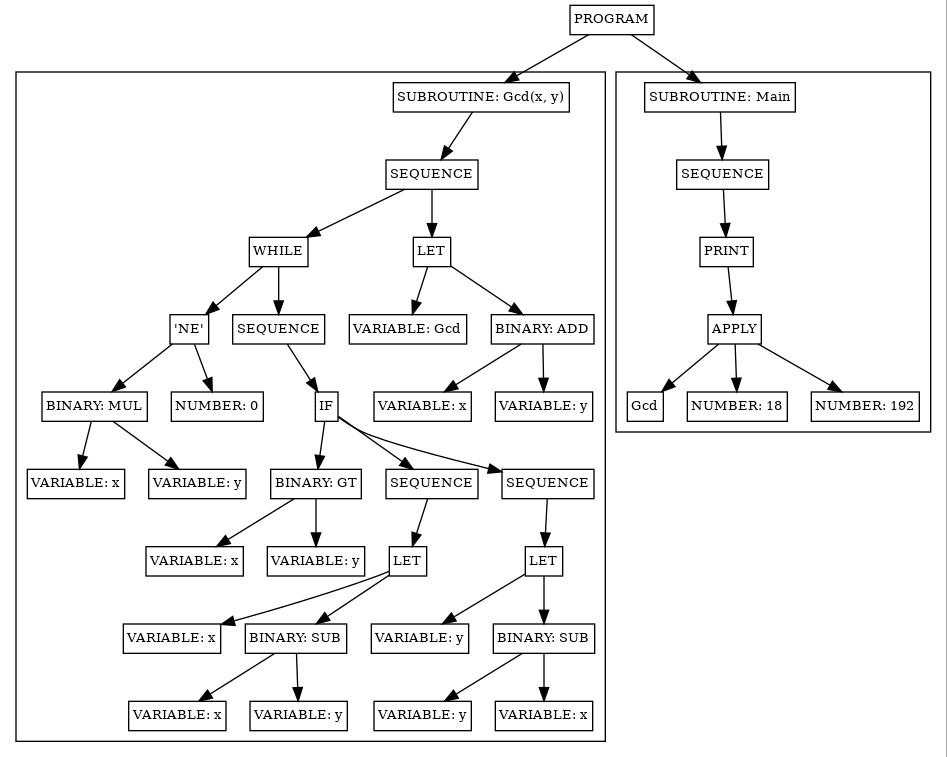

# Պատմություն վերացական շարահյուսական ծառից LLVM IR գեներացնելու միասին

> Հեղինակը պատմում է, թե ինչպես է ինքը մի պարզ ծրագրավորման լեզվի շարահյուսական վերլուծության արդյունքում կառուցված վարացական շարահյուսական ծառից գեներացնում LLVM համակարգի միջանկյալ ներկայացման՝ IR կոդ։

Պատկերացնենք իրականացնում ենք ալգորիթմական ծրագրավորման լեզու, տվյալ դեպքում առանց այն էլ պարզ BASIC լեզվի մի ավելի պարզ տարատեսակ, որին տվել ենք _BASIC IR_ անվանումը։ Այս լեզվով գրված ծրագրերի վերլուծության արդյունքում գեներացվում է վերացական շարահյուսական ծառ (Abstract Syntax Tree — AST), որի հանգույցներն իրար նկատմամբ ունեն ստորև բերված սխեմայում պատկերված ժառանգման հարաբերությունները։


Այս հիերարխիայում մասնակցող բոլոր տիպերի համար պետք է գեներացնենք LLVM֊ի միջանկյալ ներկայացման՝ IR, կոդ։

Վերլուծության արդյունքում կառուցված AST֊ի արմատում միշտ «Ծրագիր» (`Program`), տիպի օբյեկտ է, որի որդիները «Ենթածրագիր» (`Subroutune`), տիպի օբյեկտներ են, որոնց որդիներն էլ, իրենց հերթին, «Հրամաններ» (`Statement`) կամ «Արտահայտություններ» (`Expression`) են: Օրինակ, բոլորիս քաջ հայտնի հետևյալ ծրագրից․

```BASIC
SUB Gcd(x, y)
    WHILE x * y <> 0
        IF x > y THEN
            LET x = x - y
        ELSE
            LET y = y - x
        END IF
    END WHILE
    LET Gcd = x + y
END SUB

SUB Main
    PRINT Gcd(18, 192)
END SUB
```

գեներացվելու է վերացական շարահյուսական ծառ՝ մոտավորապես այսպիսի տեքսի․



Համարենք, որ ծառի հանգույցներից միջանկյալ ներկայացման կոդ գեներացնելու համար ունենք `emit(...)` անունով մեթոդների խումբ։ Այդ մեթոդներն իրարից տարբերվում են պարամետրի, իսկ երբեմն նաև՝ վերադարձվող արժեքի տիպերով։ Մեր բերած օրինակի ծառի համար `emit(...)` մեթոդների կանչը կունենա այսպիսի հաջորդականություն․

```C++
emit(Program)
  emit(Subroutine)
    emit(Sequence)
      emit(While)
        emit(Binary)
          emit(Binary)
            emit(Variable)
            emit(Variable)
          emit(Number)
        emit(Sequence)
          emit(If)
            emit(Binary)
              emit(Variable)
              emit(variable)
            emit(Sequence)
              emit(Let)
                emit(Binary)
                  emit(Variable)
                  emit(Variable)
            emit(Sequence)
              emit(Let)
                emit(Binary)
                  emit(Variable)
                  emit(Variable)
      emit(Let)
        emit(Binary)
          emit(Variable)
          emit(Variable)
  emit(Subroutine)
    emit(Sequence)
      emit(Print)
        emit(Apply)
          emit(Number)
          emit(Number)
```


## IrEmitter դասը

LLVM IR֊ը գեներացնելու համար իրականացված է AST֊ի հանգույցները ռեկուրսիվ այցելող `IrEmitter` դասը։

```C++
class IrEmitter {
public:
    IrEmitter();
```

Այս դասի ինտերֆեյսում միակ `emit()` մեթոդն է, որն ունի երկու պարամետր։ Առաջինը վերլուծվող ծրագրից կառուցված AST֊ի արմատն է՝ `ProgramPtr`, իսկ երկրորդը գեներացվող միջանկյալ ներկայացումը պարունակող ֆայլի ճանապարհը․

```C++
    bool emit(ProgramPtr prog, const std::filesystem::path& onm);
```

Վերացական շարահյուսական ծառի ամեն մի հանգույցի տիպի համար `IrEmitter` դասում իրականացված է համապատասխան `emit()` մեթոդ։

```C++
private:
    void emit(ProgramPtr prog);
    void emit(SubroutinePtr subr);

    void emit(StatementPtr st);
    void emit(SequencePtr seq);
    void emit(LetPtr let);
    void emit(InputPtr inp);
    void emit(PrintPtr pri);
    void emit(IfPtr sif);
    void emit(ForPtr sfor);
    void emit(WhilePtr swhi);
    void emit(CallPtr cal);

    llvm::Value* emit(ExpressionPtr expr);
    llvm::Value* emit(ApplyPtr apy);
    llvm::Value* emit(BinaryPtr bin);
    llvm::Value* emit(UnaryPtr una);
    llvm::Value* emit(TextPtr txt);
    llvm::Constant* emit(NumberPtr num);
    llvm::Constant* emit(BooleanPtr num);
    llvm::UnaryInstruction* emit(VariablePtr var);
```
